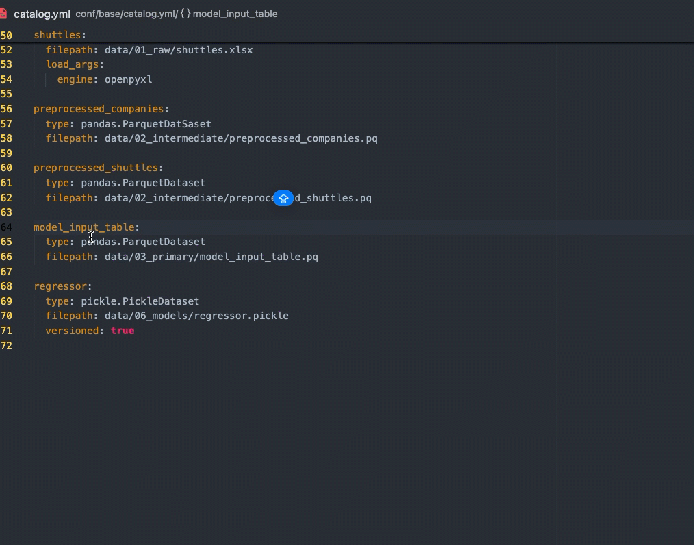

# vscode-kedro
It's in a beta status so it's not uncommon to have breaking feature and bugs, report this in Github or Slack, we will try to fix ASAP.

## How to use this extension
1. Install `Kedro` from the extension
2. Select the correct Python interpreter that you use to run the Kedro project`Python: select interpreter`

p.s. If you can `kedro run` with the environment it's good to go.

## Requirements
1. VS Code 1.64.0 or greater
1. Python extension for VS Code


The extension requires `bootstrap_project` in Kedro, you need to make sure you can do `kedro run` without getting any immediate error, otherwise you may get a server panic error.

## How to restart a server if there are error
Click `Output` and select `Kedro` from the dropdown list. It may gives you some hints and report back if you think this is a bug.

Hit `Cmd` + `Shift` + `P` to open the VSCode command, look for `kedro: restart server` in case it's panic

# Feature
## Go to Definition from pipeline.py to configuration files
Use `Cmd` (Mac)/ `Ctrl` (Window) + `Click` or `F12` to trigger `Go to Definition`


## Go to Reference from configuration files to pipeline.py
- `Cmd` or `Ctrl` (Window) + `Click` on the definition.
- Use `Find Reference`
- Use the shortcut `Shift` + `F12`


**Note:** You can find pipeline reference in all the files containing "pipeline" in their names, even in nested subdirectories. 
```
- pipelines
  - sub_pipeline
    - pipeline_data_processing.py
    - sub_pipeline_1
        - pipeline_data_processing_1.py
```

## Autocompletion in Python
Type `"` in any `pipeline.py` and it should trigger the autocompletion list.


## Schema Validation


## Hover
Just hover your mouse over any `params:` or hit the command `Show or Focus Hover`

